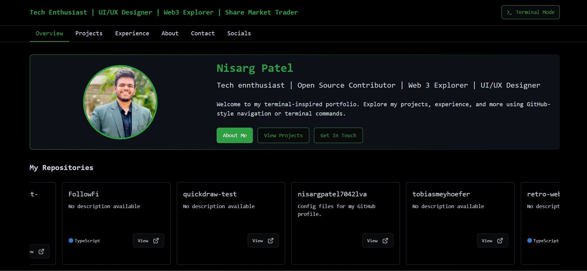

# 🌐 Nisarg Patel — Developer Portfolio

Welcome to my personal portfolio website! This site showcases my skills, projects, and experiences as a developer, designer, and web3 Enthusiast. Built using modern web technologies, this portfolio reflects my journey, creativity, and commitment to creating impactful digital experiences.

## 🚀 Live Website

👉 [Visit my portfolio](https://nisargxplores-portfolio.vercel.app/)

## 📸 Preview

 <!-- Add a real screenshot here if available -->

## 🛠️ Built With

- **HTML5**
- **CSS3**
- **JavaScript**
- **Responsive Web Design**

## ✨ Features

- Clean and modern UI
- Responsive design for all devices
- Interactive sections (projects, contact, etc.)
- Fast-loading and lightweight
- Simple animations to enhance UX

## 👨‍💻 About Me

I'm Nisarg Patel — a web designer, developer, and share market trader passionate about technology, design, and building cool things. From UI/UX design to web development and Web3 explorations, I'm always on the lookout for exciting challenges.

## 🧠 What I Learned

- Structuring and deploying a responsive portfolio
- Writing clean and maintainable HTML/CSS/JS
- Enhancing user experience with subtle animations
- Showcasing personal brand effectively

## 📬 Contact Me

Feel free to connect with me:

- Twitter: [NisargXplores](https://x.com/NisargPatel5563)
- LinkedIn: [Nisarg Patel](https://www.linkedin.com/in/nisarg-patel-7b799a277)
- Portfolio: [Nisarg Patel](https://nisargxplores-portfolio.vercel.app/)

## 📌 Future Improvements

- Add project filtering by tech stack
- Include a blog section for tech articles
- Add dark mode toggle

## 🧾 License

This project is open-source and free to use for inspiration and learning purposes. Attribution appreciated!

---

🌟 _If you like it, leave a ⭐ on the repo and connect with me!_
